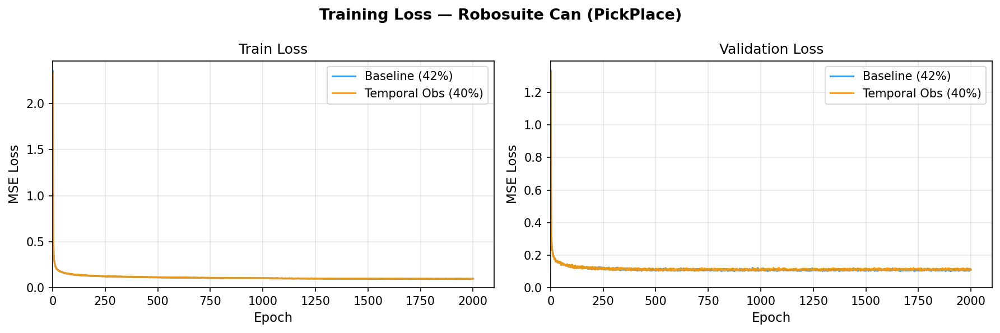
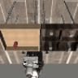
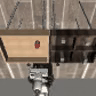
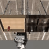
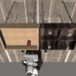

# Dexterous Diffusion Policy v5

Visual diffusion policy experiments on [robosuite](https://robosuite.ai/) Can manipulation task. Built from scratch to understand how architectural choices affect performance.

## Task

**PickPlaceCan** — robot arm picks up a soda can and places it in a bin. Observations: single 84×84 RGB image + proprioception (EEF pose + gripper). Actions: 7-DoF end-effector control.

Dataset: robomimic `can_ph` (proficient human demonstrations).

---

## Results

Evaluated with 50 rollouts, DDIM 20 steps, max 400 steps per episode.

| Experiment | Key Change | Success Rate | Mean Reward |
|---|---|---|---|
| **baseline** | small_cnn, obs_h=1, act_h=16 | **42%** | 2.14 |
| temporal_obs | obs_h=2, concat fusion | 40% | 3.16 |

### Training Curves



### Rollout Demos

**Baseline — Success / Failure**

<p float="left">
  
  
</p>

**Temporal Obs — Success / Failure**

<p float="left">
  
  
</p>

---

## Architecture

```
Image (84×84×3)
    └─ SmallCNN → img_emb (128-d)
                        ┐
Proprioception (9-d)    ├─ concat → obs_emb → MLP Noise Predictor
    └─ Linear → (32-d)  ┘              (3 layers, 256 hidden)
                                            │
                                    DDPM / DDIM (100 train steps)
                                            │
                                   Action chunk (16 × 7-d)
```

**Diffusion details:** cosine β-schedule, ε-prediction, DDIM inference, action clipping ±1.

---

## Key Findings

1. **Single-frame observation is sufficient** — adding a second observation frame (obs_h=2, concat fusion) barely moves the needle (42% → 40%). The Can task is largely solvable from a single image.

2. **Temporal obs yields higher reward when it succeeds** — temporal_obs has lower success rate but higher mean reward (3.16 vs 2.14), suggesting it executes more cleanly when it does work.

3. **DDIM steps ≠ more is better** — at test time, 100 DDIM steps perform worse than 20 (baseline: 42% → 30%, temporal_obs: 40% → 34%). The model optimizes for its training inference schedule; swapping it out at eval hurts.

---

## Setup

```bash
conda create -n diffusion python=3.10
conda activate diffusion
pip install -e .
pip install -r requirements.txt
```

Download the robomimic Can dataset:
```bash
python scripts/download_dataset.py --task can
```

---

## Training

```bash
python scripts/train_visual.py \
    --config experiments/baseline/configs/config.yaml
```

---

## Evaluation

```bash
python scripts/evaluate_robosuite_visual.py \
    --checkpoint experiments/baseline/checkpoints/final.pt \
    --config experiments/baseline/configs/config.yaml \
    --num_episodes 50 \
    --num_ddim_steps 20 \
    --video_dir experiments/baseline/videos/eval \
    --max_videos 10
```

---

## TensorBoard

```bash
tensorboard --logdir=experiments --port=6006
```

---

## References

- [Diffusion Policy (Chi et al., 2023)](https://diffusion-policy.cs.columbia.edu/)
- [robosuite](https://robosuite.ai/)
- [robomimic](https://robomimic.github.io/)
